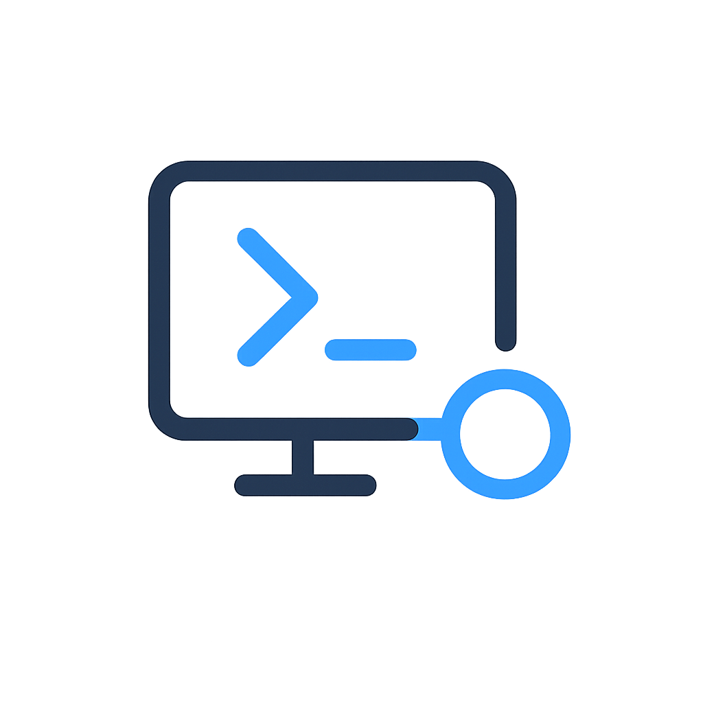
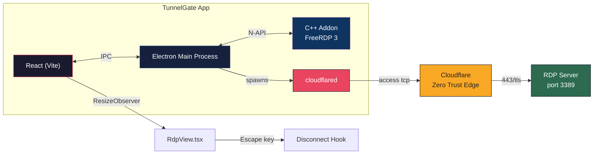
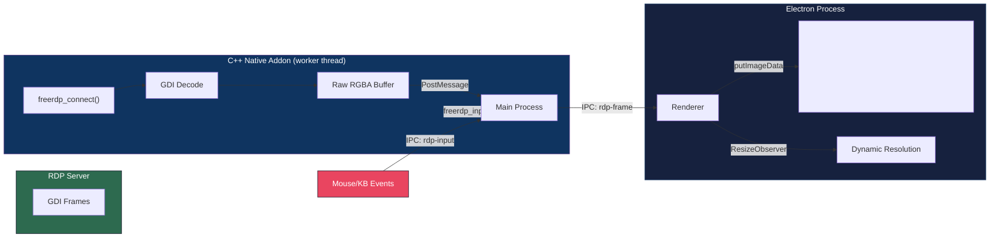

<p align="center">
  
</p>

<h1 align="center">TunnelGate</h1>

<p align="center">
  <strong>One-click RDP through Cloudflare Zero Trust Tunnel</strong>
  <br>
  <sub>In-app FreeRDP 3 viewer &bull; Native fullscreen &bull; Cross-platform</sub>
</p>

<p align="center">
  <a href="https://github.com/RandomKid24/cloudflareRDB-gui/releases">
    
  </a>
  
  
  
  
  <br>
  
  
  
  
</p>

<p align="center">
  <i>No terminals. No config files. No headache. Just point, click, and connect to your remote desktop through Cloudflare Zero Trust.</i>
</p>

---

## ✨ Features

| | Feature | Details |
|---|---|---|
| 🚀 | **One-click Connect** | Tunnel + RDP in a single click via `cloudflared access tcp` |
| 🖥️ | **In-app RDP Viewer** | FreeRDP 3 GDI rendering in an Electron `<canvas>`, no external client needed |
| 📐 | **Dynamic Resolution** | Auto-detects viewport size via `ResizeObserver`, adapts to `DesktopResize` events |
| 🪟 | **True Fullscreen** | Native Fullscreen API hides OS taskbar & window chrome; auto-hide toolbar reveals on hover |
| 🔐 | **Zero Plaintext Secrets** | Passwords encrypted at rest with Electron `safeStorage` (DPAPI / Keychain / libsecret) |
| 🪟 | **Native Client Fallback** | Launch `mstsc.exe` (Windows) or Microsoft Remote Desktop (macOS) with pre-filled credentials |
| 🔄 | **Auto-Reconnect** | Survives transient tunnel interruptions |
| ⌨️ | **Escape Auto-Disconnect** | Press <kbd>Esc</kbd> to disconnect RDP + close tunnel cleanly |
| 🌍 | **Cross-Platform** | macOS (Intel & Apple Silicon), Windows x64, Linux x64 |

---

## 🧠 Architecture

### System Overview



### RDP Rendering Pipeline



---

## 🚀 Quick Start

### Prerequisites

| Component | macOS | Windows | Linux |
|---|---|---|---|
| **Node.js** | `brew install node` | [Download](https://nodejs.org/) 18+ | `apt install nodejs npm` |
| **cloudflared** | `brew install cloudflared` | [Download .msi](https://github.com/cloudflare/cloudflared/releases) | `apt install cloudflared` |
| **FreeRDP 3** | `brew install freerdp` | vcpkg / prebuilt DLLs | `apt install freerdp3-dev` |
| **Build Tools** | Xcode CLI: `xcode-select --install` | VS 2022 BuildTools + cmake | `build-essential` + cmake |

### Install & Run

```sh
git clone https://github.com/RandomKid24/cloudflareRDB-gui.git
cd cloudflareRDB-gui
npm install
npm run build:all     # builds C++ addon + compiles TypeScript + bundles Vite
npm run dev           # Vite dev server + Electron with hot reload
```

> **Windows note**: If `npm run dev` has a PowerShell escape issue, use separate terminals:
> ```sh
> # Terminal 1
> npm run dev:renderer
> # Terminal 2
> npm run dev:main
> ```

### Package for Distribution

```sh
# macOS — DMG
npm run build:all && npx electron-builder --mac

# Windows — NSIS Installer
npm run build:all && npx electron-builder --win

# Linux — AppImage + .deb
npm run build:all && npx electron-builder --linux
```

---

## 🧩 How It Works

1. **Add a tunnel** — Enter hostname, username, and password (encrypted at rest via OS-level crypto)
2. **Click connect** — The app spawns `cloudflared access tcp --hostname <host> --url localhost:<port>`
3. **Tunnel ready** — Once `cloudflared` prints the "ready" signal, the in-app RDP viewer starts
4. **RDP negotiation** — The C++ addon connects via FreeRDP 3 with NLA (HYBRID) security, TLS encryption
5. **Frame rendering** — FreeRDP decodes GDI frames into raw RGBA buffers, streamed to a React `<canvas>` via IPC
6. **Interaction** — Keyboard & mouse events are forwarded back through the tunnel to the RDP server
7. **Dynamic resize** — `ResizeObserver` tracks viewport changes; the canvas adjusts in real-time
8. **Fullscreen** — Native Fullscreen API hides all OS chrome; toolbar stays accessible on hover
9. **Disconnect** — Press <kbd>Esc</kbd> or click the back button; both kill `cloudflared` and disconnect FreeRDP

### Toolbar Behavior (Fullscreen)

| State | Appearance |
|---|---|
| **Idle** | Opacity `0.15` — nearly invisible, no distraction |
| **Hover** | Opacity `1.0` — full controls visible |
| **Interaction** | Buttons for disconnect, native client launch, minimize |

---

## 🔐 Security

| Measure | Detail |
|---|---|
| **Password storage** | Encrypted with Electron `safeStorage` — uses DPAPI (Windows), Keychain (macOS), or libsecret (Linux) |
| **No disk plaintext** | Passwords are decrypted in-memory only at connection time |
| **No shell injection** | All processes spawned with `argv` arrays, never shell strings |
| **Hostname validation** | Strict regex before any connection attempt |
| **Electron hardening** | `contextIsolation: true`, `nodeIntegration: false`, `sandbox: true` |
| **No credential logging** | Passwords are never written to log files or console output |

---

## 🛠 Development

### Build From Scratch

```sh
git clone https://github.com/RandomKid24/cloudflareRDB-gui.git
cd cloudflareRDB-gui
npm install
npm run build:all
npm run dev
```

### RDP Session Resolution

The app auto-detects the available viewport space using `ResizeObserver` on the RDP container element. The toolbar height is subtracted from the available area so the canvas fills exactly the space below the toolbar. Resolution is capped at 2560×1440.

When the server reports a resolution change via FreeRDP's `DesktopResize` callback, the canvas buffer is updated in real-time and the render loop re-targets the new dimensions.

### macOS: Code Signing Workarounds

#### "App is damaged" Gatekeeper Fix

After downloading TunnelGate on macOS, Gatekeeper may strip the quarantine attribute:

```sh
xattr -cr /Applications/TunnelGate.app
```

This removes the `com.apple.quarantine` extended attribute that macOS sets on downloaded apps, allowing the app to launch without the "damaged" warning.

#### Build Without Signing

```sh
CSC_IDENTITY_AUTO_DISCOVERY=false npm run build:all && npx electron-builder --mac --dir
```

#### Electron Framework Corruption (macOS 26+ "Tahoe")

On macOS 26 (Tahoe) and later, `electron-builder`'s built-in ad-hoc code signing process corrupts the `Electron Framework` binary during packaging. The workaround is to replace the Framework binary from the pristine `node_modules/electron/dist` copy and re-sign:

```bash
# 1. Replace the corrupted Framework binary with the original
cp node_modules/electron/dist/Electron.app/Contents/Frameworks/Electron\ Framework.framework/Versions/A/Electron\ Framework \
   release/mac-arm64/TunnelGate.app/Contents/Frameworks/Electron\ Framework.framework/Versions/A/Electron\ Framework

# 2. Deep re-sign the entire app bundle
codesign --deep --force --sign - --options runtime \
   --entitlements build/entitlements.mac.plist \
   release/mac-arm64/TunnelGate.app
```

**Why this happens**: `electron-builder` re-codesigns all binaries inside the app bundle during packaging. On macOS 26+, the ad-hoc signing process (`--sign -`) corrupts the Framework's internal code signature hash, rendering the binary unloadable. Copying the untouched binary from `node_modules` restores the original, and the explicit `codesign` pass reapplies signatures correctly.

### Windows: OpenSSL Legacy Provider

On Windows, FreeRDP 3 requires the OpenSSL **legacy provider** for RC4 during the RDP licensing handshake. The C++ addon automatically:

1. Writes a minimal `openssl.cnf` config file at runtime
2. Sets `OPENSSL_MODULES` and `OPENSSL_CONF` environment variables via `_putenv_s` at DLL load time (inside a global `EnvVarInitializer`)
3. Loads the `legacy` + `default` providers via `OSSL_PROVIDER_load()` before any connection

The legacy DLL (`legacy.dll`) is deployed alongside the addon in the `ossl-modules/` subdirectory during the build step. See [`docs/TUNNELGATE_COMPLETE.md`](docs/TUNNELGATE_COMPLETE.md) for the full deep-dive on the 14 bugs resolved during development.

---

## 📁 Project Structure

```
src/
├── main/                  # Electron main process
│   ├── ipcHandlers.ts     # IPC channel registration
│   ├── rdpViewManager.ts  # Addon bridge, lastDimensions map, error interception
│   ├── tunnelManager.ts   # cloudflared spawn/kill lifecycle
│   ├── credentialStore.ts # safeStorage encrypt/decrypt wrapper
│   └── store.ts           # electron-store persistence
├── renderer/              # React frontend (Vite)
│   ├── App.tsx            # Root component with RDP view wrapper
│   ├── views/
│   │   └── RdpView.tsx    # ResizeObserver, fullscreen, toolbar, Escape handler
│   └── components/
│       └── RdpCanvas.tsx  # Canvas rendering, rAF paint loop, mouse input
├── preload/               # Context bridge (exposes IPC to renderer)
├── native/                # C++ FreeRDP 3 addon
│   └── rdp-addon/
│       ├── rdp_session.h / .cpp   # connect, callbacks, frame encoding
│       └── rdp_module.cpp         # N-API module entry point
├── shared/                # Shared TypeScript types & interfaces
└── scripts/
    ├── build-native.js    # cmake-js builder, auto-detects VS via vcvarsall, DLL deploy
    └── generate-icons.ps1 # Icon generation from source PNG
```

---

## 📚 Documentation

| Doc | Description |
|---|---|
| [`docs/RDP_NATIVE_ADDON.md`](docs/RDP_NATIVE_ADDON.md) | Full C++ addon architecture, FreeRDP 3 API usage, GDI rendering pipeline (~15 KB) |
| [`docs/TUNNELGATE_COMPLETE.md`](docs/TUNNELGATE_COMPLETE.md) | Complete project reference — all components, IPC flow, error codes, credentials (~32 KB) |
| [`docs/REPLICATE_FROM_SCRATCH.md`](docs/REPLICATE_FROM_SCRATCH.md) | Standalone replication guide — build from zero, all 14 bugs with file:line and before/after (~67 KB) |

---

## 🤝 Contributing

PRs are welcome! If you find a bug or have a feature request, [open an issue](https://github.com/RandomKid24/cloudflareRDB-gui/issues).

**Before submitting a PR:**

1. Run `npm run build` to ensure TypeScript and Vite compile
2. Test on your target platform
3. Update docs if your change affects the user interface or build process

---

## 📄 License

MIT — see [LICENSE](LICENSE).

---

<p align="center">
  
  <br>
  <sub><strong>forged by beforth</strong></sub>
  <br>
  <sub>Made with ❤️ for remote workers everywhere.</sub>
  <br>
  <sub>Not affiliated with Cloudflare, Microsoft, or FreeRDP.</sub>
</p>
