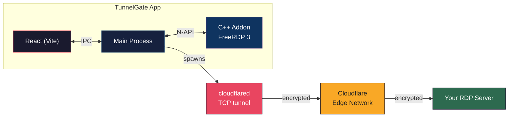

# TunnelGate

> **One-click RDP through Cloudflare Tunnel** — seamless, secure, and beautifully simple.

<p align="center">
  
  
  
  
  
</p>

<p align="center">
  <i>No terminals, no config files, no headache. Just point, click, and connect.</i>
</p>

---

## ✨ Features

- **🚀 One-click connect** — tunnel + RDP in a single click
- **🖥️ In-app RDP viewer** — FreeRDP-powered rendering inside an Electron window with dynamic resolution (auto-detects screen size)
- **🪟 True fullscreen** — native Fullscreen API hides taskbar; auto-hide toolbar reveals on hover
- **🔐 Zero plaintext secrets** — passwords encrypted with OS-level crypto (DPAPI / Keychain / libsecret)
- **🪟 Native RDP client** — launch `mstsc.exe` (Windows) or Microsoft Remote Desktop (macOS) with pre-filled credentials
- **🔄 Auto-reconnect** — survives transient tunnel interruptions
- **🎨 Beautiful UI** — React + Vite + dark mode
- **🌍 Cross-platform** — macOS (Intel & Apple Silicon), Windows, Linux

---

## 📦 Downloads

| Platform | Architecture | Package |
|---|---|---|
| **macOS** | Intel | `TunnelGate-1.0.0.dmg` |
| **macOS** | Apple Silicon | `TunnelGate-1.0.0-arm64.dmg` |
| **Windows** | x64 | `TunnelGate Setup 1.0.0.exe` |
| **Linux** | x64 | `TunnelGate-1.0.0.AppImage` |
| **Linux** | x64 | `tunnelgate_1.0.0_amd64.deb` |

---

## 🚀 Quick Start

### Prerequisites

| Component | macOS | Windows | Linux |
|---|---|---|---|
| **cloudflared** | `brew install cloudflared` | [Download .msi](https://github.com/cloudflare/cloudflared/releases) | `apt install cloudflared` |
| **FreeRDP** | `brew install freerdp` | vcpkg / prebuilt DLLs | `apt install freerdp3-dev` |

### Install & Run

```sh
npm install
npm run build:all     # build native addon + TypeScript + Vite
npm run dev           # Vite dev server + Electron (hot reload)
```

### Package for Distribution

```sh
# macOS (DMG)
npm run build:all && npx electron-builder --mac

# Windows (NSIS installer)
npm run build:all && npx electron-builder --win

# Linux (AppImage + .deb)
npm run build:all && npx electron-builder --linux
```

---

## 🧠 How It Works



1. **Add a tunnel** — enter hostname, username, and password (encrypted at rest)
2. **Click connect** — spawns `cloudflared access tcp --hostname <host> --url localhost:<port>`
3. **Tunnel ready** — app detects the "ready" signal and starts the in-app RDP viewer
4. **RDP rendering** — FreeRDP 3 decodes frames in C++, streams them to a React `<canvas>`
5. **Interactive** — keyboard & mouse events are forwarded back to the RDP server
6. **Disconnect** — kills cloudflared, cleans up Windows credentials

### RDP Rendering Pipeline

Remote Desktop frames are decoded in a native C++ addon using **FreeRDP 3 GDI rendering**, then streamed pixel-by-pixel to a `<canvas>` element via Electron IPC. See [`docs/RDP_NATIVE_ADDON.md`](docs/RDP_NATIVE_ADDON.md) for the full architecture.

The RDP session resolution is dynamically matched to the available viewport space (capped at 2560×1440), and the canvas auto-adjusts when the server reports a different resolution via `DesktopResize`.

### Windows: OpenSSL Legacy Provider

On Windows, FreeRDP 3 requires the OpenSSL **legacy provider** for RC4 during RDP licensing. The addon auto-writes an `openssl.cnf` config, sets `OPENSSL_MODULES`/`OPENSSL_CONF` at DLL load time, and loads the legacy + default providers before connecting. See [`docs/TUNNELGATE_COMPLETE.md`](docs/TUNNELGATE_COMPLETE.md) for details.

---

## 🔐 Security

- **Passwords never touch disk in plaintext** — encrypted with Electron `safeStorage` (DPAPI, Keychain, or libsecret)
- **No shell injection** — all spawned processes use `argv` arrays
- **Hostname validation** — strict regex before any connection attempt
- **Electron hardening** — `contextIsolation: true`, `nodeIntegration: false`
- **No credential logging** — passwords are never written to logs

---

## 🛠 Development

### RDP Session Resolution

The app auto-detects the viewport size using `ResizeObserver` and passes it as the initial RDP resolution on connect. The C++ addon also forwards `DesktopResize` events from the server, which update the canvas rendering in real-time. This ensures the RDP desktop fills the available space regardless of monitor resolution.

### macOS Only: Code Signing Workarounds

#### "App is damaged" fix

```sh
xattr -cr /Applications/TunnelGate.app
```

#### Build without signing

```sh
CSC_IDENTITY_AUTO_DISCOVERY=false npm run build:all && npx electron-builder --mac --dir
```

#### Electron Framework corruption (macOS 26+)

On macOS 26 (Tahoe), `electron-builder`'s built-in code signing corrupts the Electron Framework binary. Replace it after building:

```bash
cp node_modules/electron/dist/Electron.app/Contents/Frameworks/Electron\ Framework.framework/Versions/A/Electron\ Framework \
   release/mac-arm64/TunnelGate.app/Contents/Frameworks/Electron\ Framework.framework/Versions/A/Electron\ Framework

codesign --deep --force --sign - --options runtime \
  --entitlements build/entitlements.mac.plist \
  release/mac-arm64/TunnelGate.app
```

---

## 📁 Project Structure

```
src/
├── main/            # Electron main process
│   ├── ipcHandlers.ts
│   ├── rdpViewManager.ts
│   ├── tunnelManager.ts
│   ├── credentialStore.ts
│   └── store.ts
├── renderer/        # React frontend (Vite)
│   └── views/
│       └── RdpView.tsx
├── preload/         # Context bridge
├── native/          # C++ FreeRDP addon
│   └── rdp-addon/
│       ├── rdp_session.h / .cpp
│       └── rdp_module.cpp
└── shared/          # Shared TypeScript types
```

---

## 🤝 Contributing

PRs are welcome! If you find a bug or have a feature request, [open an issue](https://github.com/RandomKid24/cloudflareRDB-gui/issues).

Before submitting a PR:
1. Run `npm run build` to ensure TypeScript and Vite compile
2. Test on your target platform
3. Update docs if your change affects the user interface or build process

---

<p align="center">
  Made with ❤️ for remote workers everywhere.
  <br>
  <sub>Not affiliated with Cloudflare, Microsoft, or FreeRDP.</sub>
</p>
